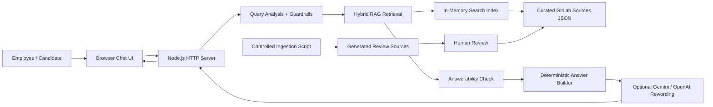
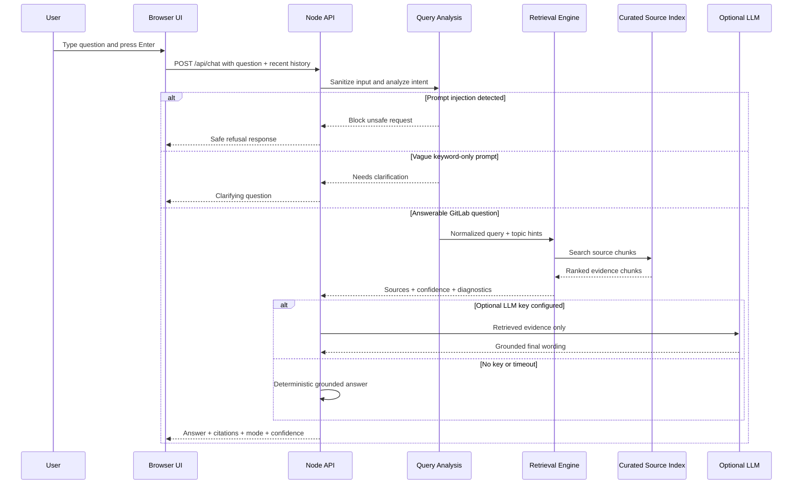
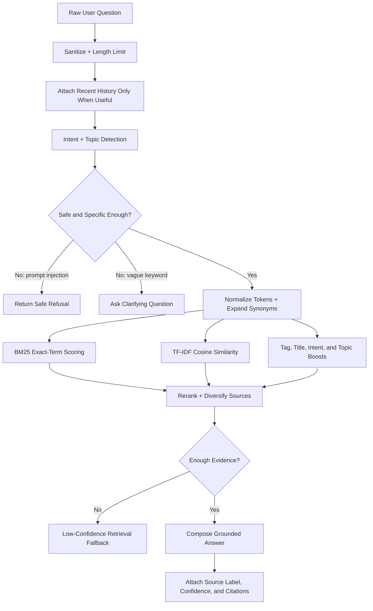

# Project Write-Up: GitLab Handbook Chatbot

## Objective

The project brief asks for an interactive Generative AI chatbot that helps employees and aspiring employees access information from GitLab's public Handbook and Direction pages. My solution focuses on trustworthy answers, source transparency, and a smooth user experience for follow-up questions.

## Final Solution

I built a retrieval-augmented chatbot with a polished web interface and a dependency-free Node.js backend. The app runs locally without an API key, but can use OpenAI or Gemini when credentials are provided.

The chatbot supports:

- questions about GitLab values, remote work, communication, meetings, transparency, and iteration;
- questions about GitLab's product direction, DevSecOps platform strategy, AI, GitLab Duo, Secure, Verify, Plan, and source-code workflows;
- follow-up questions using recent conversation context;
- source citations with relevance scores and source sections;
- clarification for vague keyword-only prompts instead of over-answering from a single trigger word;
- low-confidence refusal when the loaded material does not support an answer;
- prompt-injection handling.

## Technical Approach

The system has three layers:

1. **Knowledge base**: `data/sources.json` contains curated GitLab Handbook and Direction source cards with summaries, highlights, employee use cases, tags, and official URLs.
2. **Query understanding**: `src/queryAnalysis.js` decides whether the input is answerable, ambiguous, unsupported, or unsafe before retrieval begins.
3. **Retrieval engine**: `src/chatbot.js` chunks each source into overview, evidence, and employee-use-case sections. It scores chunks using a hybrid retrieval method: BM25, TF-IDF cosine similarity, tag overlap, source weighting, query-intent boosts, and full-query overlap.
4. **Answerability layer**: retrieved chunks are checked for topic support and meaningful overlap before the chatbot answers.
5. **Answer layer**: the app creates a deterministic grounded answer from retrieved evidence. If `OPENAI_API_KEY` or `GEMINI_API_KEY` is configured, the top retrieved chunks are passed to the model for more natural final wording.
6. **Knowledge refresh**: `scripts/ingest.js` can crawl controlled public GitLab pages into generated review files, so coverage can expand without automatically polluting production answers.

## Architecture and Flow Diagrams

### High-Level System Architecture



### Question Processing Sequence



### Retrieval Pipeline



The full diagram set, including deployment, runtime modes, index structure, and the data refresh pipeline, is available in `docs/DIAGRAMS.md`.

## Key Decisions

- **No required API key**: reviewers can run and evaluate the project immediately.
- **Hybrid retrieval instead of simple keyword search**: BM25 handles exact matches while vector-style TF-IDF helps with related wording.
- **Chunk-level evidence**: source pages are split into smaller evidence units, improving answer precision.
- **Transparent UI**: the app displays source count, chunk count, mode, confidence, cited sources, and source sections.
- **Guardrails**: unsupported questions return a low-confidence refusal, and prompt-injection attempts are blocked.
- **Context-aware retrieval**: vague inputs like `MR`, `async`, or a random sentence containing `pipeline` ask for clarification instead of producing a canned answer.
- **Reliable optional generation**: LLM calls have a timeout and fail back to deterministic retrieval, so the chatbot remains usable even if a provider is slow.
- **Evaluation-first engineering**: `npm test` and `npm run eval` provide repeatable proof that the chatbot retrieves expected topics and rejects weak prompts.
- **Review-first ingestion**: generated website content is written separately and must be reviewed before it is copied into the curated knowledge base.

## Product Thinking

The target user is an employee or candidate. They do not only need an answer; they need confidence that the answer came from the right GitLab material. The UI therefore makes citations and confidence visible instead of hiding retrieval details.

Suggested prompts guide new users into high-value questions. The chat supports follow-ups, and the sidebar keeps the current evidence visible so users can jump to the original GitLab pages.

## Innovation

Beyond the basic brief, the project adds:

- source-section transparency;
- candidate-focused answer framing;
- prompt-injection guardrail;
- query clarification and answerability scoring;
- optional OpenAI and Gemini providers;
- LLM timeout fallback for stable user interaction;
- controlled GitLab page ingestion with generated review reports;
- evaluation script with pass/fail criteria;
- deploy-ready `render.yaml`;
- architecture and deployment documentation.

## Evaluation

The evaluation suite covers common project-success questions:

- remote work and async collaboration;
- candidate understanding of values;
- product direction and DevSecOps;
- transparency guardrails;
- AI and GitLab Duo direction.

Current result:

```text
Positive evaluation: 16/16 passed
Negative/guardrail evaluation: 6/6 passed
```

## Limitations and Future Work

The current knowledge base is curated for quality and review speed. A production version would add:

- scheduled crawling of Handbook and Direction pages using the existing review-first ingestion pipeline;
- heading-aware page chunking;
- embeddings with a vector database;
- source freshness monitoring;
- analytics for unanswered questions;
- admin UI for reviewing generated source chunks.

## Running Locally

```bash
npm install
npm run dev
```

Open `http://127.0.0.1:3000`.

## Deployment

The app can be deployed to Render, Railway, Fly.io, or any Node 18+ host. The repository includes `render.yaml` for a fast Render deployment.

Environment variables are optional:

- `OPENAI_API_KEY`
- `OPENAI_MODEL`
- `GEMINI_API_KEY`
- `GEMINI_MODEL`
- `LLM_TIMEOUT_MS`
