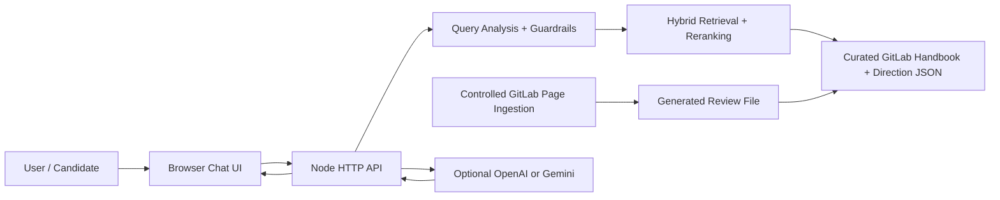

# Architecture

## System Overview

For the full diagram set, see `docs/DIAGRAMS.md`.

## Retrieval Pipeline

1. **Analyze query**: classify prompt-injection attempts, vague keyword-only prompts, explicit GitLab context, domain terms, and likely topics.
2. **Clarify when needed**: short prompts like `MR`, `AI`, `async`, or random sentences containing one trigger word ask for clarification instead of forcing retrieval.
3. **Normalize query**: lowercase, tokenize, stem simple endings, expand domain synonyms such as `async`, `DevSecOps`, `direction`, and `AI`.
4. **Chunk sources**: each source becomes overview, evidence, and employee-use-case chunks.
5. **Score and rerank chunks**: combine BM25, TF-IDF cosine similarity, tag overlap, source weights, intent boosts, full-query overlap, and topic support.
6. **Assess answerability**: require enough retrieved support before answering; otherwise return a low-confidence fallback.
7. **Diversify sources**: prefer useful coverage across multiple source pages instead of repeating the same page.
8. **Generate answer**: produce deterministic grounded wording, or call OpenAI/Gemini when an API key is available.
   Optional LLM calls have a timeout and fall back to deterministic retrieval if the provider fails.
9. **Expose evidence**: return source links, source sections, confidence, mode, and lightweight diagnostics.

## Knowledge Refresh Pipeline

`scripts/ingest.js` crawls only allowed GitLab public hosts, removes page chrome, extracts useful content blocks, and writes candidate source cards to `data/sources.generated.json` with a separate `data/ingestion-report.json`.

The chatbot intentionally reads only `data/sources.json`. Generated sources must be reviewed, copied into the curated file, covered by evaluation cases, and verified with `npm run verify` before deployment.

## Why This Stands Out

- The project does not depend on an API key to work during evaluation.
- Query policy is modularized in `src/queryAnalysis.js` and domain config lives in `src/ragConfig.js`, so robustness is not hidden in scattered one-off patches.
- The UI exposes confidence, mode, source relevance, and source sections.
- `npm run eval` creates a repeatable quality signal for both positive questions and negative/vague guardrail cases.
- The ingestion pipeline is review-first, so expanding coverage does not silently pollute production answers.
- The architecture can grow into embeddings/vector DB later without changing the product surface.
