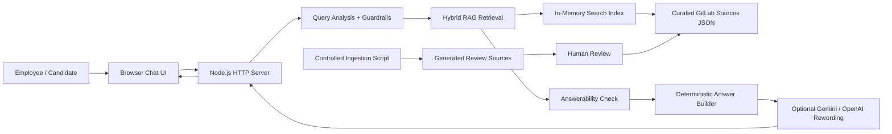
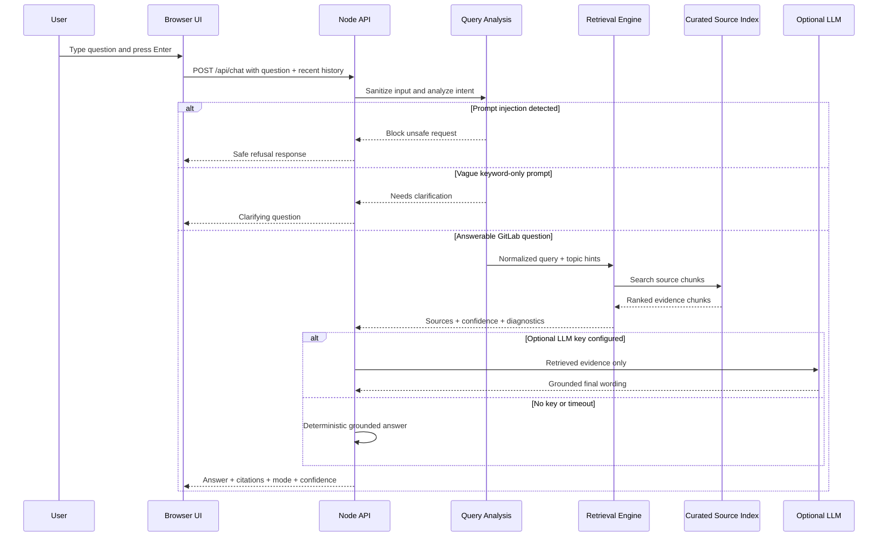
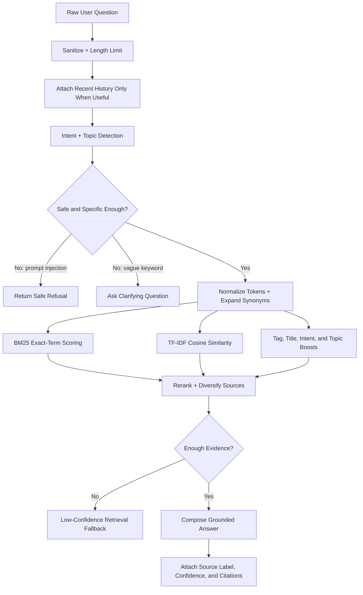
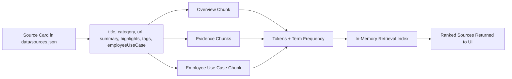
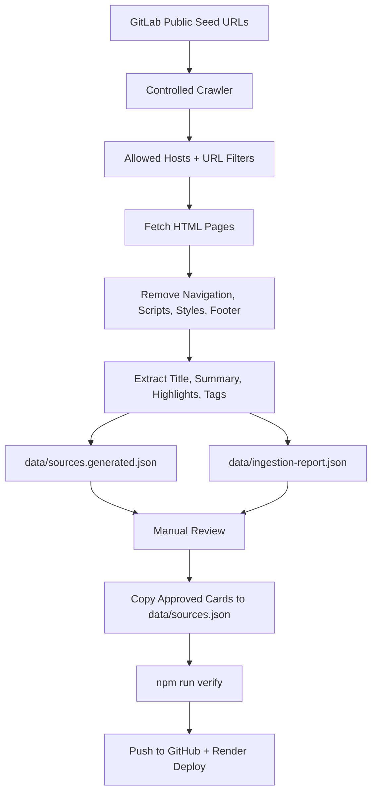
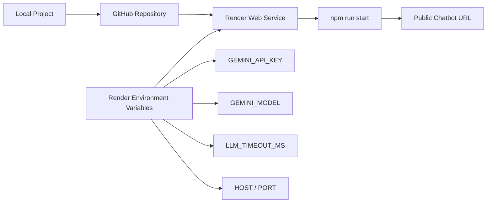
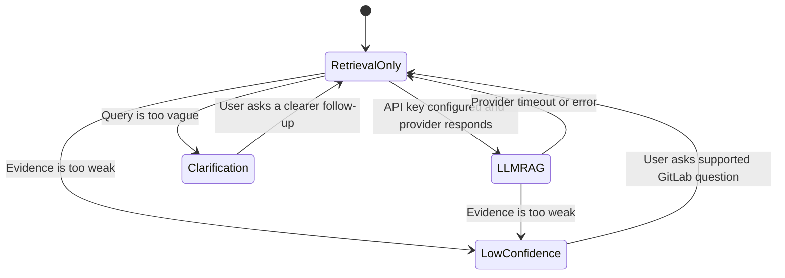

# System Diagrams

These diagrams explain how the GitLab Handbook Chatbot processes a user question, retrieves evidence, optionally uses an LLM, and keeps its knowledge base reviewable.

## 1. High-Level System Architecture

## 2. User Question Sequence

## 3. RAG Processing Pipeline

## 4. Knowledge Base and Index Structure

## 5. Controlled Data Refresh Pipeline

## 6. Deployment Flow

## 7. Runtime Modes

## Recommended Placement

- Put diagrams 1, 2, and 3 in the Google Doc write-up.
- Keep diagrams 4, 5, 6, and 7 in the GitHub repository for technical reviewers.
- If the Google Doc becomes too long, include diagram 1 only in the main write-up and link to `docs/DIAGRAMS.md` for the full set.
